# PETZYIEE - Online scheduling pet full stack web application system

## Key Features.
- Dynamic home page, serving as the landing page for all users.
- User login page with professional handling of all kinds of validations.
- Ability for a user to select an appointment.
- Option to select a service and view appointment date.
- CRUD operations and additional features.
- Responsive design with a dynamic header and preloader.

#### What Technology are Used In This Projects

**Front End :** 
- React
- JavaScript(ES6)
- React-Bootstrap
- Html
- CSS5
- Meterail UI
- React Animation
- Preloader
- Alert
- Validation

**Back-End:** 
- MongoDb
- Express
- Cors
- Body-Parse
- Nodemon
- ImageUploader 
 
# Sign In Page (In this component functionaliy via vanila Javascript and Make this strong Pass and Validation )
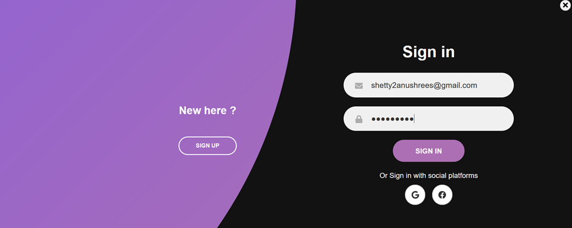

# Sign Up (In this component functionaliy via vanila Javascript and Make this strong Pass and Validation )
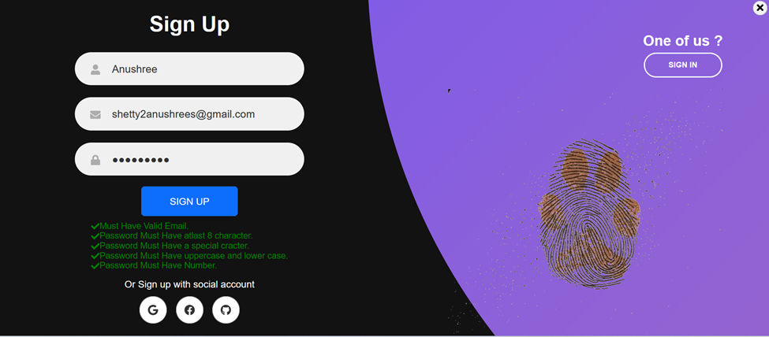
# Landing Page

# Business Info
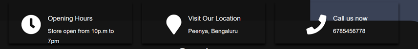
# Services
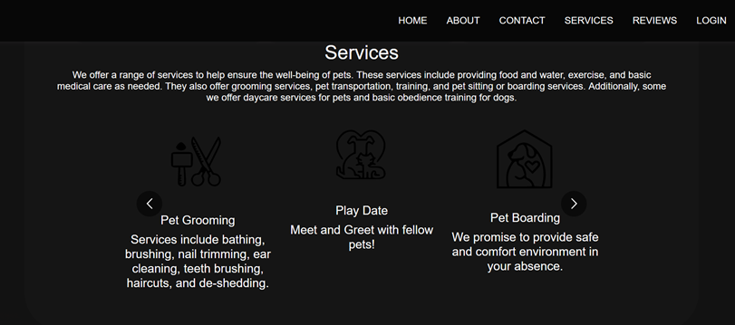
# Community
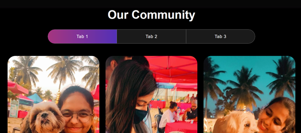
# Contact Us
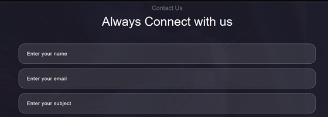
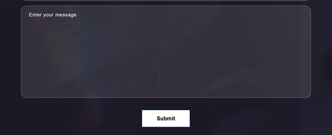
# User Have to Logged in and Add their Appointment
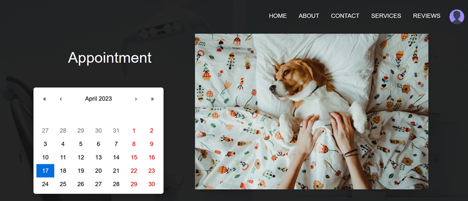
# Get AppointMenet
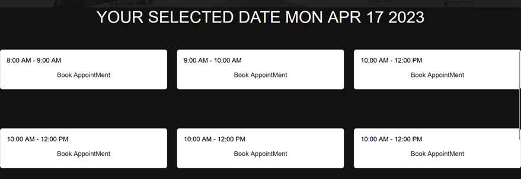
# Appointment Form
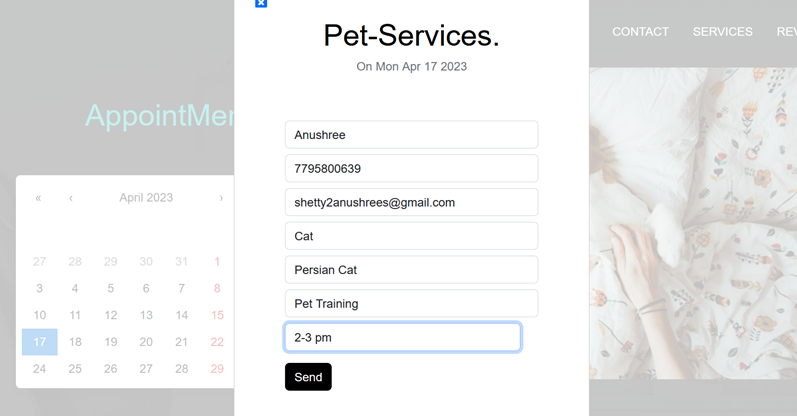
# List of Sevices.
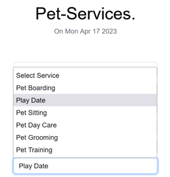
# Error Page
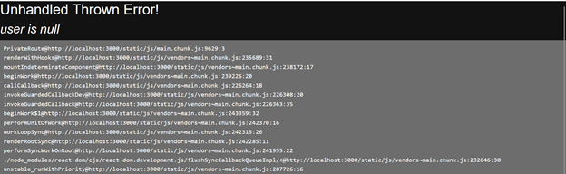
# Dashboard Page
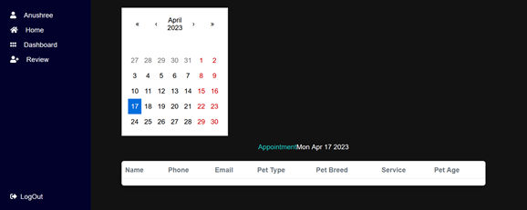
# Review Page 
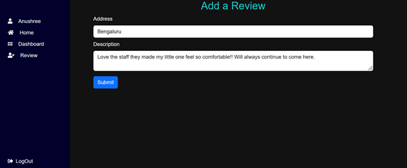
# Preview of Home page after the user login.
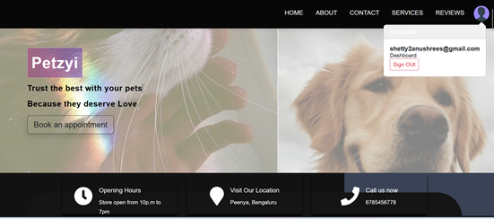
